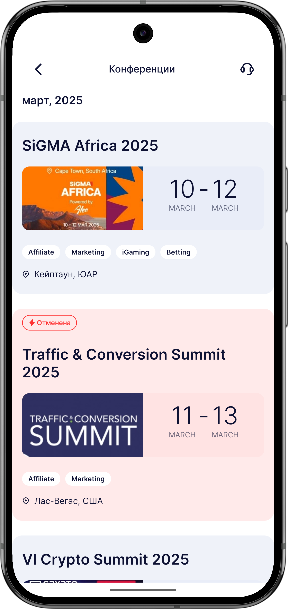
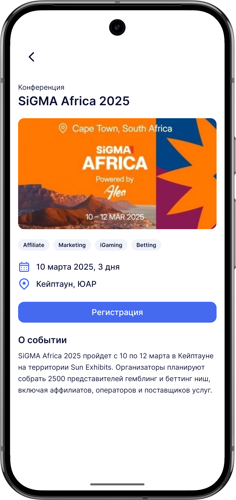

# Тестовое задание Partnerkin.

## Содержание
- [Описание проекта](#описание-проекта)
- [Функциональность](#функциональность)
- [Архитектура и подход](#архитектура-и-подход)
- [Стек технологий](#стек-технологий)
- [Как запустить](#как-запустить)
- [Скриншоты](#скриншоты)


## Описание проекта
Приложение разработано в рамках тестового задания для компании [Partnerkin](https://partnerkin.com/).
Реализован проект с функцией отображения списка конференций, разбитого по месяцам и более подробной информацией о каждом. 
Главная цель - продемонстрировать навыки работы с Kotlin, Jetpack Compose, Coroutines, Retrofit, OkHttp и т.д.

## Функциональность
- Отображение списка конференций, разбитого по месяцам
- Просмотр подробной информации о выбранной конференции
  
## Архитектура и подход
- MVI + Clean Architecture  
- Dependency Injection (Hilt)

## Стек технологий

| Область            | Технологии                         |
|--------------------|------------------------------------|
| Язык               | Kotlin                             |
| UI                 | Jetpack Compose                    |
| Сеть               | Retrofit, OkHttp                   |
| DI                 | Hilt                               |
| Навигация          | Jetpack Compose Navigation         |
| Асинхронность      | Kotlin Coroutines + Flow           |

## Как запустить

### Для проверки работы приложение скачайте APK по кнопке ниже
[](https://github.com/muratov-dev/partnerkin-test/releases/download/PartnerkinTEST/Partnerkin-1.0.0-release-unsigned.apk)
<p>Убедитесь, что в настройках телефона включена опция <strong>«Установка приложений из неизвестных источников»</strong>.</p>

### Чтобы запустить проект в Android Studio
1. Клонируйте репозиторий  
   ```bash
   git clone https://github.com/muratov-dev/partnerkin-test.git
   ```

2. Откройте проект в Android Studio.
3. Создайте в корневой папке проекта файл secrets.properties и добавьте туда `API_KEY="[ВАШ_API_КЛЮЧ]"`.
4. Запустите проект на устройстве или эмуляторе.

## Скриншоты
<div>
    
    
</div>

## Возможные улучшения

- Кэширование данных
- Тестирование
- Добавление пагинации
- Улучшение UI/UX

## Обратная связь
Буду рад фидбеку по архитектуре, UX и качеству кода.
Связь: work.yusuf.muratov@gmail.com • Telegram: @ymuratov_work
